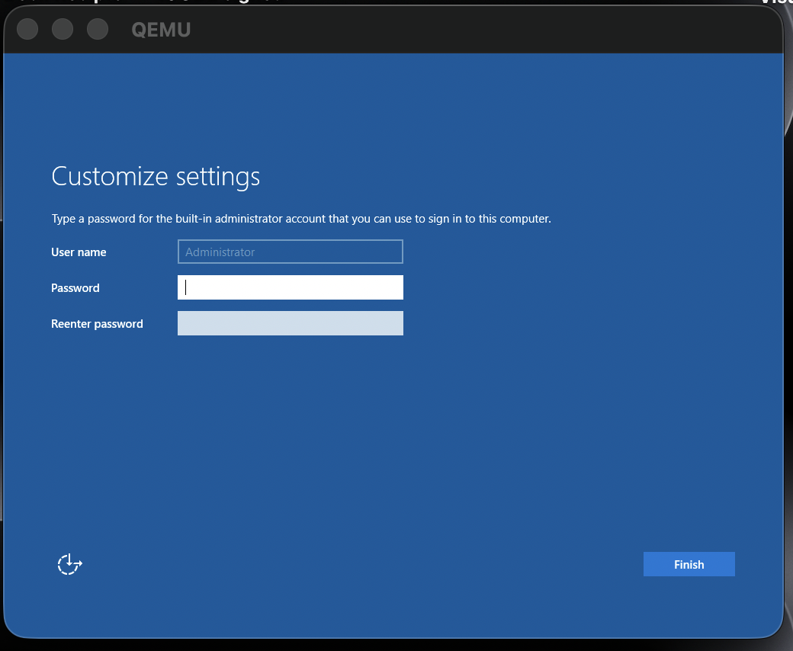
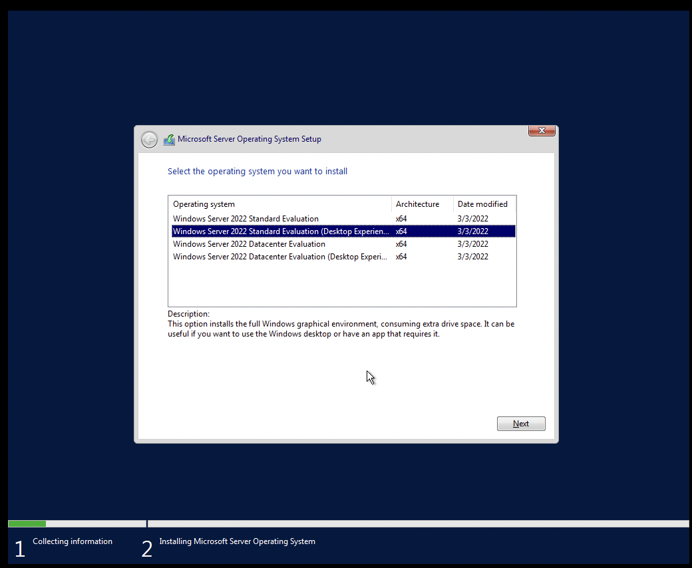
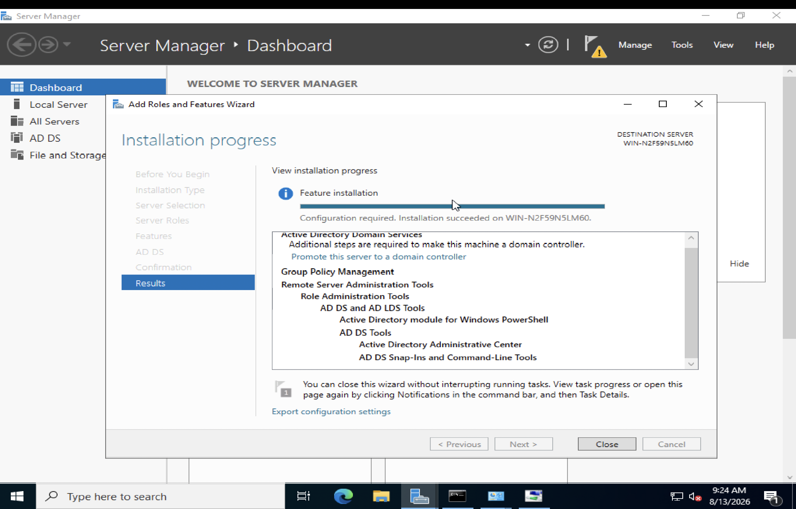
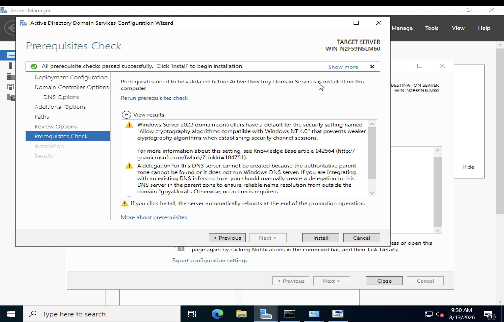
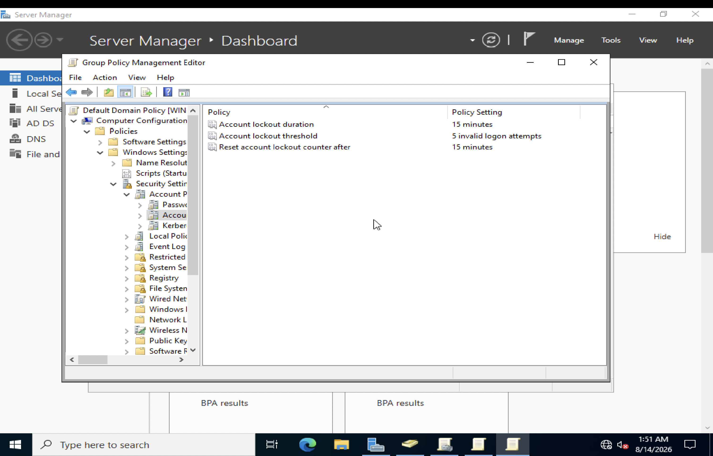
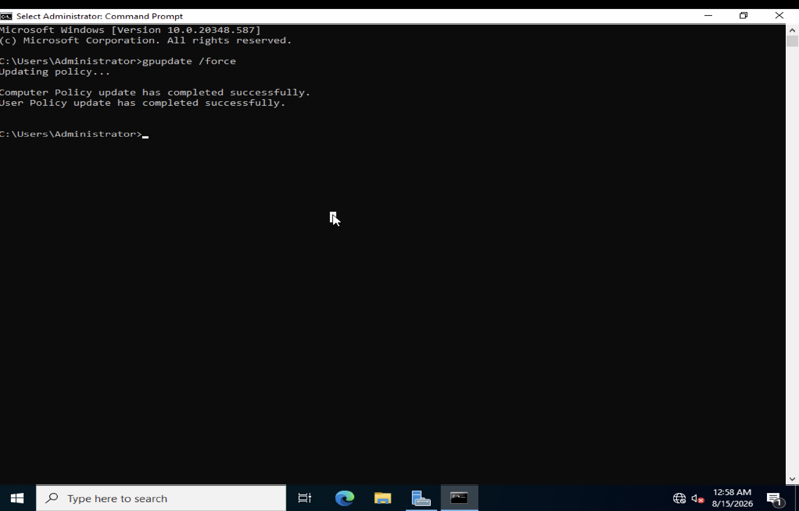
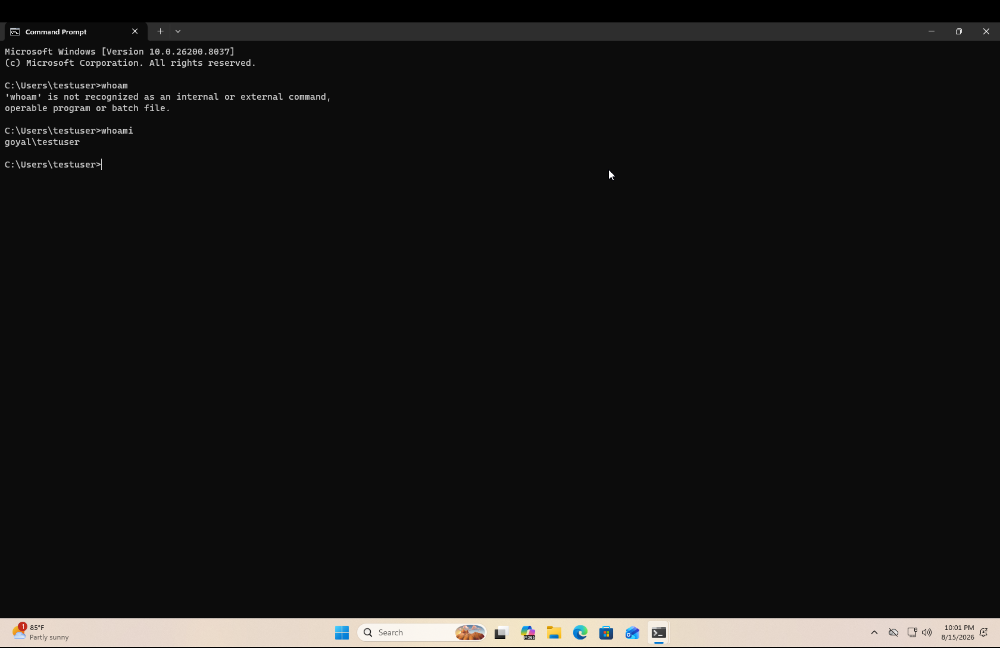
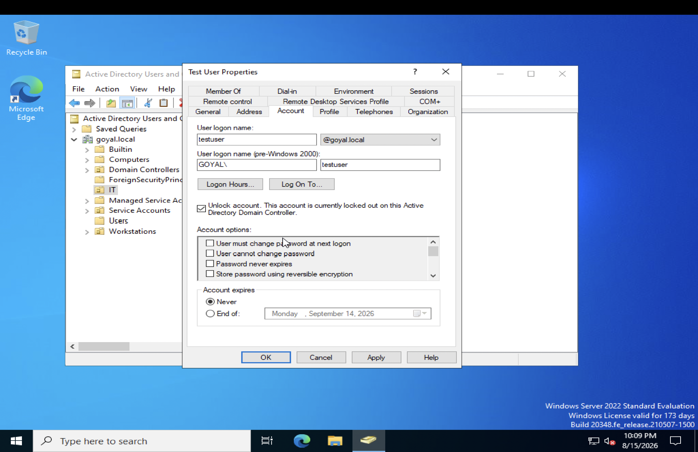
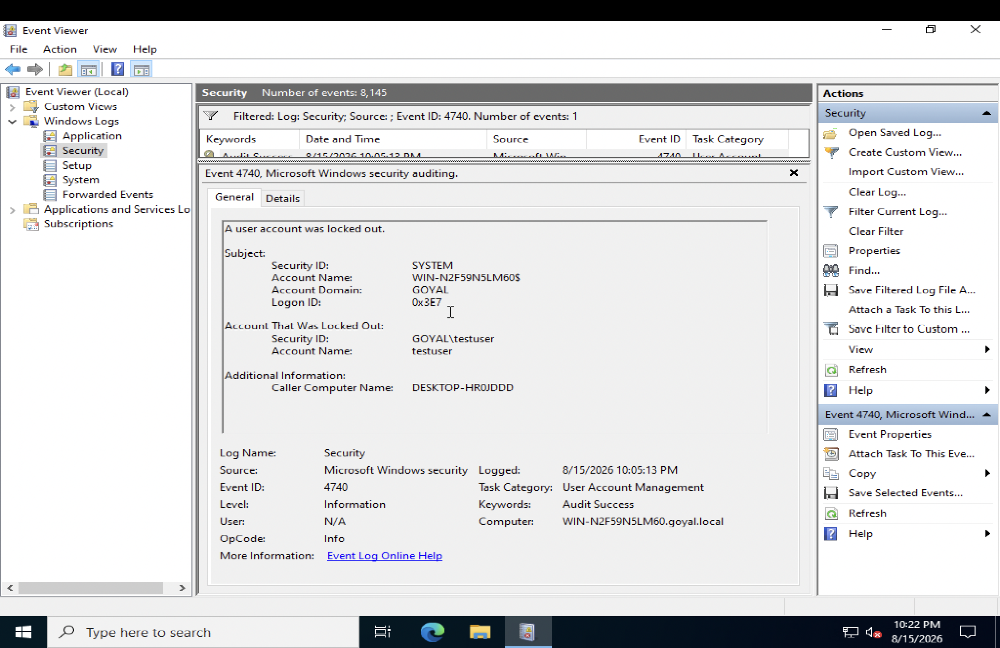

# Active Directory Security Lab

A hands on cybersecurity lab demonstrating the deployment, configuration, and security testing of a Windows Server Active Directory environment with a Windows 11 client.

**Author:** Divyanshu Goyal ([@DivyanshuGoyal13](https://github.com/DivyanshuGoyal13))

## Project Overview

This project was built to gain practical experience with Windows Server administration, Active Directory Domain Services (AD DS), Group Policy, authentication, account security, and Windows security event logging.

The lab demonstrates how an organization can use Active Directory to centrally manage users, authentication, security policies, and Windows client systems.

## Architecture
Home Network (192.168.0.x)
                              |
           +------------------+------------------+
           |                                     |
 Windows Server 2022                    Windows 11 (ARM64)
 Running under QEMU                     Running under VMware Fusion
 192.168.0.200                          192.168.0.141
           |                                     |
 Domain Controller                       Client joined to
 Active Directory Domain Services        goyal.local
 DNS Server
 goyal.local
           |
 +---------+----------+---------------+
 |         |          |               |
IT   Workstations  Service        Users (built in)
 |    Accounts
 +-- Test User
 +-- Lab Admin

 The Domain Controller and client were built on two different hypervisors on the same Mac. QEMU emulated the x64 Windows Server, and VMware Fusion ran the Windows 11 ARM64 client natively on Apple Silicon. Each VM initially lived on its own isolated virtual network, so neither could see the other. Both were reconfigured to use bridged networking on the same physical subnet, then the client's DNS was pointed at the Domain Controller so it could resolve goyal.local and authenticate correctly.

## Lab Environment

| Component         | Configuration                                       |
| ----------------- | --------------------------------------------------- |
| Server            | Windows Server 2022                                 |
| Server Role       | Active Directory Domain Controller                  |
| Directory Service | Active Directory Domain Services (AD DS)             |
| Client            | Windows 11 (ARM64)                                  |
| Server Hypervisor | QEMU                                                 |
| Client Hypervisor | VMware Fusion                                        |
| Management        | Active Directory Users and Computers / Group Policy  |

## Objectives

The primary objectives of the lab were to:

* Deploy a Windows Server environment
* Install Active Directory Domain Services
* Promote the server to a Domain Controller
* Configure domain authentication
* Configure password security policies
* Configure account lockout controls
* Apply Group Policy
* Create and manage domain accounts
* Join and configure a Windows 11 client across two different hypervisors
* Test authentication and account security
* Investigate Windows security events

## Implementation

### 1. Windows Server Deployment

A Windows Server virtual machine was deployed and configured as the foundation of the Active Directory environment.

### 2. Active Directory Domain Services

The Active Directory Domain Services role was installed on the Windows Server system.

The server was then prepared for Domain Controller promotion.

### 3. Group Policy and Security Configuration

Group Policy was used to apply security related configurations to the domain, including an account lockout threshold of 5 invalid attempts and a lockout duration of 15 minutes.

After configuration changes, Group Policy was refreshed using `gpupdate`.

### 4. Domain Authentication

Domain authentication was tested using a domain account.

Password policy enforcement was also tested by attempting a weak password on first sign in.

The `whoami` command was used to verify the authenticated domain identity.

### 5. Account Lockout Testing

The account lockout policy was intentionally triggered by generating failed authentication attempts.

The locked account was then located and unlocked through Active Directory Users and Computers.

### 6. Security Event Investigation

Windows Event Viewer was used to investigate the account lockout.

Security Event ID **4740** was reviewed to identify the account associated with the lockout.

This demonstrates a basic security investigation workflow using Windows event logs.

### 7. Windows 11 Client

A Windows 11 client was deployed on VMware Fusion as part of the lab environment.

The client provides a practical example of how Windows endpoints can interact with a centralized Active Directory environment, including across two separate virtualization platforms.

## Security Concepts Demonstrated

### Identity and Access Management

Active Directory was used to centrally manage domain identities and authentication.

### Password Security

Password policy controls were configured and tested to demonstrate centralized enforcement of authentication requirements.

### Account Lockout

Account lockout controls were implemented to help mitigate repeated failed authentication attempts.

### Group Policy

Group Policy was used to centrally apply security settings across the domain environment.

### Security Monitoring

Windows security logs were examined to investigate account lockout activity using Event ID 4740.

### Authentication Investigation

The lab demonstrated how authentication failures and account lockouts can be investigated through Active Directory and Windows Event Viewer.

### Cross Platform Troubleshooting

The lab required diagnosing and resolving a real networking problem between two virtual machines running on different hypervisors, including CPU architecture mismatches during setup and bridged network configuration to enable domain communication.

## Skills Demonstrated

* Active Directory
* Windows Server
* Windows 11
* Active Directory Domain Services (AD DS)
* Group Policy
* Identity and Access Management (IAM)
* Authentication
* Password Policies
* Account Lockout Policies
* Windows Event Viewer
* Security Event ID 4740
* User and Account Administration
* Virtual Machine Administration
* Network Troubleshooting
* Basic Security Investigation

## Project Documentation

Detailed configuration information is available in:

[`documentation/lab-configuration.md`](documentation/lab-configuration.md)

Implementation evidence is available in:

[`screenshots/`](screenshots/)

## Project Outcome

This lab provided practical experience building and securing a Windows Active Directory environment from the initial server deployment through authentication testing, security policy enforcement, account lockout investigation, and Windows client integration across two different virtualization platforms.

The project demonstrates practical cybersecurity skills in identity management, Windows security, authentication, security policy configuration, network troubleshooting, and basic security monitoring.
